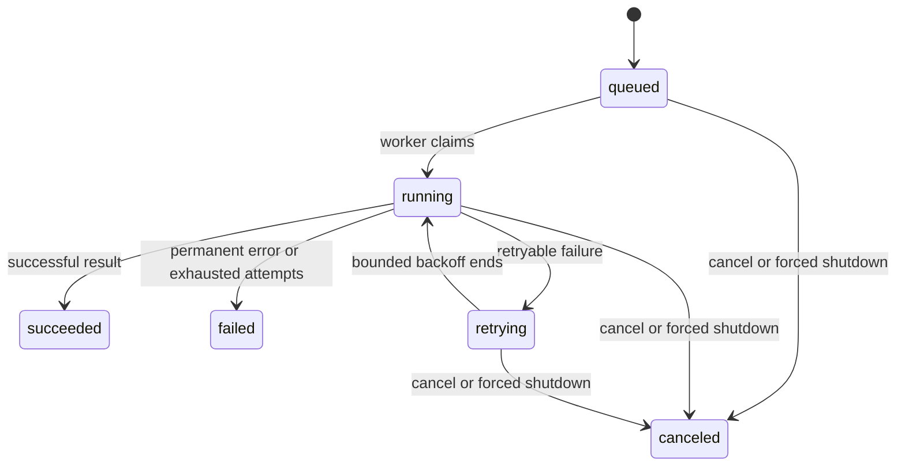
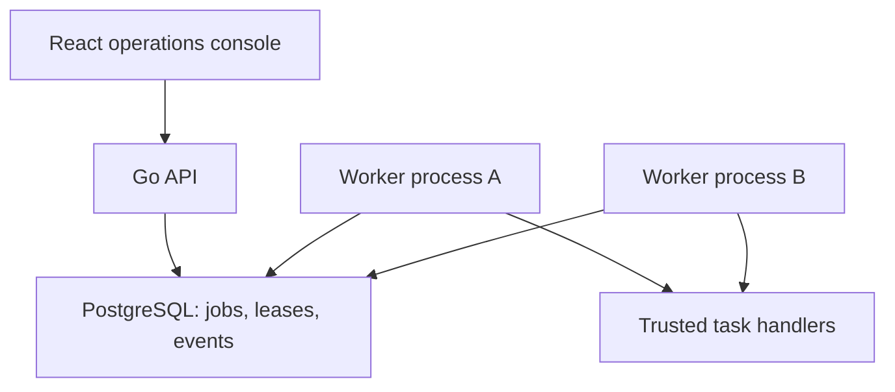

# Architecture and decisions

## Problem and scope

Internal platforms need to accept background work, bound execution, explain failures and let operators intervene. Small Chain makes those contracts inspectable in a small codebase. A checksum task is a safe deterministic workload for exercising the scheduler; it is not a performance benchmark or an untrusted build sandbox.

M1 is one Go binary with three boundaries: HTTP transport, lifecycle engine, and a cooperative executor function. There is no speculative repository abstraction: a durable scheduler needs transactional claim/finish operations, not generic CRUD. M2.1 adds concrete PostgreSQL admission, M2.2 adds transactional claiming and fencing tokens, and M2.3 consumes those tokens for heartbeat and outcomes. Expired-lease recovery and the database worker loop remain separate increments.

## State machine

Timeout is a terminal failure in M1, since blindly retrying deadlines can amplify overload. Only errors wrapped with `jobs.Retryable` are retried. Panic recovery records a permanent failure and keeps the worker alive; it does not expose panic contents to clients.

## Invariants and concurrency ownership

1. Concurrent submissions of the same key and normalized request create one job. Reusing a key for a different spec conflicts. Keys are validated, retained, and never logged.
2. Enqueue and record/key insertion occur under one mutex. A worker may receive the ID immediately, but cannot read its record until admission releases the mutex. A full channel commits neither record nor key.
3. Exactly `workers` worker goroutines execute tasks. A bounded channel prevents unbounded pending work. HTTP uses Go's normal per-connection goroutines; this is not a global connection limit.
4. All record mutations use the engine mutex. `Get` returns a value copy with no shared mutable members. Executor code never runs with that mutex held.
5. Terminal states are immutable. Cancellation wins if it acquires the state lock before completion; otherwise a finished task returns 409 on cancel. A late executor result cannot undo cancellation.
6. `StopAdmission` closes the queue under the same mutex used by submission, preventing send-on-closed-channel races. Workers drain it before exiting.
7. Retained jobs and keys are capped together. This bounds record count, not all process memory: HTTP buffers, goroutine stacks and runtime overhead also consume memory. Input size and HTTP deadlines add separate bounds.

An attempt gets a child deadline of the job context, canceled immediately after return. A result returned after its deadline fails even with nil executor error. Runtime shutdown uses one total budget for HTTP drain plus worker drain; expiry cancels all nonterminal jobs and returns an error exit status.

## Explicit tradeoffs

| Decision | Benefit | Cost / upgrade trigger |
| --- | --- | --- |
| Standard library only in M1 | Small dependency surface, easy review/startup | Adopt maintained metrics/OTel libraries for histograms/traces |
| One mutex for state | Simple atomic admission and transitions | Profile contention first; metrics snapshots scan bounded records |
| Backoff sleeps inside worker | No extra scheduler goroutines or timer heap | Retrying work consumes slots; M2 uses `available_at` and releases claims during delays |
| Canceled queued IDs remain in channel | No unsafe channel-removal protocol | Capacity reclaimed when a worker dequeues the tombstone |
| Retain terminal records up to cap | Stable idempotency during process lifetime | Finite demo lifetime; M2 adds documented retention/expiration |
| Fixed trusted executor | Reproducible fault injection | Untrusted CI execution needs a separate isolation design |

## M2.1: durable admission (implemented, not wired to HTTP)

`internal/postgres` persists normalized specs and SHA-256 fingerprints, with a
unique key and explicit READ COMMITTED transactions. Replays use a separate
statement after conflict to see a concurrent winner. `cmd/migrate` serializes
migration execution with a transaction advisory lock and verifies checksummed
history. At the M2.1 migration boundary the schema restricts state to queued and
attempts to zero; the following migration expands those invariants for claims.
Database connection/query/lock waits are bounded. Full protocol, retention
limitations and real-database tests are in [the PostgreSQL guide](postgres.md).
The M1 HTTP/worker process is unchanged; it cannot claim durable acceptance yet.

## M2.2: transactional claims (implemented, not wired to workers)

Migration `0002_leases.sql` persists `max_attempts`, `available_at`, lease owner,
monotonic version and expiry. Database constraints couple `running` state to a
complete lease and keep attempts within the normalized request budget. A partial
`(available_at, id)` index contains only queued/retrying rows.

`ClaimDue` validates batch/lease bounds, opens a short READ COMMITTED transaction,
then selects due rows in deterministic order with `FOR UPDATE SKIP LOCKED` and
updates them in one statement. Claiming increments attempts and lease version,
sets expiry from PostgreSQL `statement_timestamp()`, and commits before returning.
Two independent pools can therefore claim different rows without coordinating in
Go. A returned `(owner, version)` is consumed by the M2.3 lifecycle operations.
An ambiguous commit returns no work, so the caller must not execute anything.

Claim does **not** make lease expiry actionable: running rows, even expired ones,
remain unavailable until the recovery transition is implemented. Heartbeat,
finish/retry/cancel are implemented store operations, but append-only events,
worker execution, recovery and HTTP persistence are still planned. This avoids
presenting a database row lock as crash recovery.

## M2.3: fenced lifecycle writes (implemented, not wired to workers)

Migration `0003_outcomes.sql` stores bounded results and errors and constrains
them to valid lifecycle states. It backfills terminal/retrying rows permitted by
the previous schema before enabling the constraint, so the migration works on a
non-empty database rather than only on a fresh test schema.

Heartbeat, completion and failure all execute as one conditional `UPDATE`. They
match job ID, owner, version, running state, and an expiry later than PostgreSQL
`statement_timestamp()`. A mismatch returns `ErrStaleLease`; an expired worker
cannot revive its own lease. Heartbeat extends expiry from database time.
Successful completion clears the lease with its result. Failure either records a
delayed retry and releases the lease or becomes terminal when the persisted
attempt budget is exhausted.

Cancellation is an authoritative operator action rather than a lease action. It
can transition queued, running or retrying jobs, increments `lease_version`, and
clears lease fields in the same statement. Repeating cancellation is idempotent;
a competing terminal completion yields exactly one winner. These operations keep
transactions shorter than task execution and backoff: no transaction is held
while user work runs.

This is state-write fencing, not exactly-once execution. Recovery of expired
running rows is not implemented, and fencing cannot roll back an external side
effect produced before a stale worker's result is rejected.

## M2 remainder: PostgreSQL as the durable queue (planned)

Keep one database and the same binary with API/worker modes. Add migrations, a database integration suite and Compose. Do not keep an in-memory channel as a second source of truth.

Implemented `jobs` records contain `id, idempotency_key, request_fingerprint, spec, state, attempts, max_attempts, available_at, lease_owner, lease_version, lease_expires_at, result, error, created_at, updated_at`. Append-only `job_events`, an expired-lease index and retention remain planned. Tenant scoping is deferred until authentication exists.

Use partial indexes restricted to eligible queued/retrying states and running leases, with deterministic `(available_at, id)` claim ordering. Validate with `EXPLAIN (ANALYZE, BUFFERS)` on representative distributions before claiming an optimization. Bound the Go connection pool and transaction/statement timeouts; never hold a database transaction during task execution or backoff.

Claim protocol:

1. **Implemented except events:** in a short transaction, select due jobs with `FOR UPDATE SKIP LOCKED`, update state, increment attempt and lease version, and set expiry. Commit before execution.
2. **Store operation implemented; worker integration planned:** execute outside the transaction. Heartbeat only while owner/version still matches. Use database time for lease comparisons.
3. **Implemented except events:** finish with a conditional update on ID, owner, version, running state and unexpired lease. Stale completion affects zero rows.
4. **Failure/retry implemented; recovery planned:** on attempt failure, set `available_at` and clear the lease atomically. Recover expired leases with version-checked transitions and the persisted attempt limit.
5. **Store operation implemented; worker polling planned:** on cancellation, persist canceled state and increment lease version. Stale results cannot overwrite canceled state; cancellation cannot undo an external side effect.

PostgreSQL describes `SKIP LOCKED` as useful for queue-like consumers, with an inconsistent view unsuitable for general-purpose reads: [official SELECT documentation](https://www.postgresql.org/docs/current/sql-select.html). Use it for task claims, not complete user-facing job lists.

| Crash / race | Required behavior and test |
| --- | --- |
| Commit succeeds but client loses response | Same-key retry returns committed job |
| Worker dies after claim | Lease expires; another worker retries within budget |
| Old worker returns after reassignment | Version check rejects stale completion |
| Side effect succeeds before result commit | Duplicate execution possible; downstream idempotency required |
| Cancellation races with completion | Transactional state/version condition selects one terminal result |
| Database unavailable at submit | Reject; never acknowledge non-durable work |

Delivery semantics are **at least once**, with fenced state writes. Exactly-once external side effects are not promised. Lease fencing protects database state only; downstream systems need their own idempotency or fencing protocol.

## Target architecture after M3 (planned)

The console adds filtered job lists, details, attempts and cancellation. Playwright proves the workflow. Kubernetes, DAG scheduling, multi-region replication, billing, arbitrary code execution and blockchain consensus are outside the portfolio release scope.
