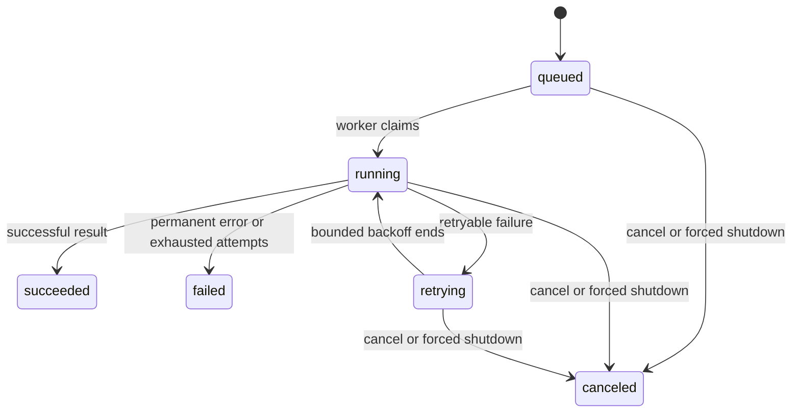
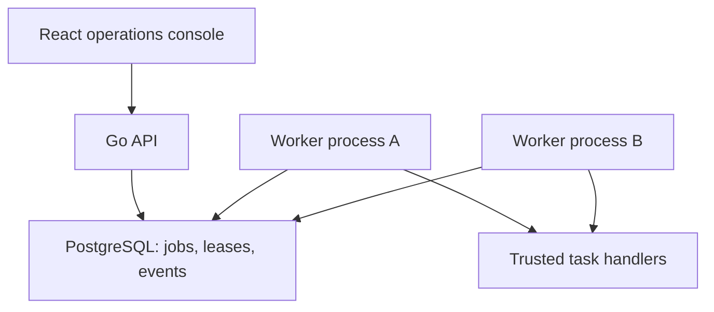

# Architecture and decisions

## Problem and scope

Internal platforms need to accept background work, bound execution, explain failures and let operators intervene. Small Chain makes those contracts inspectable in a small codebase. A checksum task is a safe deterministic workload for exercising the scheduler; it is not a performance benchmark or an untrusted build sandbox.

M1 is one Go binary with three boundaries: HTTP transport, lifecycle engine, and a cooperative executor function. There is no speculative repository abstraction: a durable scheduler needs transactional claim/finish operations, not generic CRUD. M2.1–M2.7 add durable admission, claims, fencing, recovery, a bounded worker and retention. M2.8 puts the HTTP contract on that store without an in-memory queue as a second source of truth.

## State machine

Timeout is a terminal failure in M1, since blindly retrying deadlines can amplify overload. Only errors wrapped with `jobs.Retryable` are retried. Panic recovery records a permanent failure and keeps the worker alive; it does not expose panic contents to clients.

## Invariants and concurrency ownership

1. Concurrent submissions of the same key and normalized request create one job. Reusing a key for a different spec conflicts. Keys are validated, retained, and never logged.
2. Enqueue and record/key insertion occur under one mutex. A worker may receive the ID immediately, but cannot read its record until admission releases the mutex. A full channel commits neither record nor key.
3. Exactly `workers` worker goroutines execute tasks. A bounded channel prevents unbounded pending work. HTTP uses Go's normal per-connection goroutines; this is not a global connection limit.
4. All record mutations use the engine mutex. `Get` returns a value copy with no shared mutable members. Executor code never runs with that mutex held.
5. Terminal states are immutable. Cancellation wins if it acquires the state lock before completion; otherwise a finished task returns 409 on cancel. A late executor result cannot undo cancellation.
6. `StopAdmission` closes the queue under the same mutex used by submission, preventing send-on-closed-channel races. Workers drain it before exiting.
7. Retained jobs and keys are capped together. This bounds record count, not all process memory: HTTP buffers, goroutine stacks and runtime overhead also consume memory. Input size and HTTP deadlines add separate bounds.

An attempt gets a child deadline of the job context, canceled immediately after return. A result returned after its deadline fails even with nil executor error. Runtime shutdown uses one total budget for HTTP drain plus worker drain; expiry cancels all nonterminal jobs and returns an error exit status.

## Explicit tradeoffs

| Decision | Benefit | Cost / upgrade trigger |
| --- | --- | --- |
| Standard library only in M1 | Small dependency surface, easy review/startup | Adopt maintained metrics/OTel libraries for histograms/traces |
| One mutex for state | Simple atomic admission and transitions | Profile contention first; metrics snapshots scan bounded records |
| Backoff sleeps inside worker | No extra scheduler goroutines or timer heap | Retrying work consumes slots; M2 uses `available_at` and releases claims during delays |
| Canceled queued IDs remain in channel | No unsafe channel-removal protocol | Capacity reclaimed when a worker dequeues the tombstone |
| Retain terminal records up to cap | Stable idempotency during process lifetime | Finite demo lifetime; M2 adds documented retention/expiration |
| Fixed trusted executor | Reproducible fault injection | Untrusted CI execution needs a separate isolation design |

## M2.1: durable admission (implemented; unwired at that increment)

`internal/postgres` persists normalized specs and SHA-256 fingerprints, with a
unique key and explicit READ COMMITTED transactions. Replays use a separate
statement after conflict to see a concurrent winner. `cmd/migrate` serializes
migration execution with a transaction advisory lock and verifies checksummed
history. At the M2.1 migration boundary the schema restricts state to queued and
attempts to zero; the following migration expands those invariants for claims.
Database connection/query/lock waits are bounded. Full protocol, retention
limitations and real-database tests are in [the PostgreSQL guide](postgres.md).
At that increment the M1 HTTP/worker process was unchanged; M2.8 now exposes the
store through the API.

## M2.2: transactional claims (implemented; unwired at that increment)

Migration `0002_leases.sql` persists `max_attempts`, `available_at`, lease owner,
monotonic version and expiry. Database constraints couple `running` state to a
complete lease and keep attempts within the normalized request budget. A partial
`(available_at, id)` index contains only queued/retrying rows.

`ClaimDue` validates batch/lease bounds, opens a short READ COMMITTED transaction,
then selects due rows in deterministic order with `FOR UPDATE SKIP LOCKED` and
updates them in one statement. Claiming increments attempts and lease version,
sets expiry from PostgreSQL `statement_timestamp()`, and commits before returning.
Two independent pools can therefore claim different rows without coordinating in
Go. A returned `(owner, version)` is consumed by the M2.3 lifecycle operations.
An ambiguous commit returns no work, so the caller must not execute anything.

Claim alone does **not** make lease expiry actionable: `RecoverExpired` must run
before an expired row becomes available again. Heartbeat, finish/retry/cancel and
recovery are implemented store operations. Later increments add worker execution
and HTTP persistence; append-only events remain planned. This avoids presenting
a database row lock as end-to-end crash recovery.

## M2.3: fenced lifecycle writes (implemented; unwired at that increment)

Migration `0003_outcomes.sql` stores bounded results and errors and constrains
them to valid lifecycle states. It backfills terminal/retrying rows permitted by
the previous schema before enabling the constraint, so the migration works on a
non-empty database rather than only on a fresh test schema.

Heartbeat, completion and failure all execute as one conditional `UPDATE`. They
match job ID, owner, version, running state, and an expiry later than PostgreSQL
`statement_timestamp()`. A mismatch returns `ErrStaleLease`; an expired worker
cannot revive its own lease. Heartbeat extends expiry from database time.
Successful completion clears the lease with its result. Failure either records a
delayed retry and releases the lease or becomes terminal when the persisted
attempt budget is exhausted.

Cancellation is an authoritative operator action rather than a lease action. It
can transition queued, running or retrying jobs, increments `lease_version`, and
clears lease fields in the same statement. Repeating cancellation is idempotent;
a competing terminal completion yields exactly one winner. These operations keep
transactions shorter than task execution and backoff: no transaction is held
while user work runs.

This is state-write fencing, not exactly-once execution. Fencing cannot roll back
an external side effect produced before a stale worker's result is rejected.

## M2.4: expired-lease recovery (implemented)

Migration `0004_recovery.sql` adds a partial `(lease_expires_at, id)` index for
running rows. `RecoverExpired` validates a batch and retry-delay bound, then uses
one statement to lock expired rows in deterministic lease order with `FOR UPDATE
SKIP LOCKED` and update them. Attempts below `max_attempts` become `retrying` at
database-time plus the delay; exhausted attempts become `failed`. Both paths
record a fixed reason, advance `lease_version`, and clear owner/expiry.

The statement is its own short transaction: no task execution or backoff occurs
while locks are held. Concurrent sweepers skip each other's rows, and later
sweeps ignore the transitioned rows. A stale worker cannot heartbeat or finish
after recovery. Recovery is deliberately explicit rather than hidden inside
`ClaimDue`, so the M2.5 worker schedules and can later observe it independently.

This completes the database transition needed after a worker crash. M2.5 calls
the sweep periodically, and M2.6 verifies it after killing a worker process.

## M2.5: bounded database worker (implemented as a package)

`internal/dbworker.Worker` owns one polling/recovery loop and a semaphore-sized
set of in-flight attempts. It asks `ClaimDue` for no more than its free slots,
so polling never creates an unbounded local queue. A claim transaction is fully
committed before the executor starts. Heartbeats and final writes are separate,
bounded database operations; no transaction spans task execution or retry wait.

Each executor receives the persisted attempt timeout and must cooperate with
context cancellation. Losing a heartbeat cancels that context, waits for the
trusted handler to return, and deliberately writes no result. The recovery path
can then advance the fencing version and retry the work. Success, explicitly
retryable error, and permanent error take distinct fenced store paths; panic text
is not persisted. Retry delay uses capped exponential equal jitter.

Canceling `Run` stops polling and recovery before waiting for already claimed
attempts. Those attempts retain their independent deadlines and heartbeats while
draining; this avoids abandoning a committed lease merely because the process
received a graceful shutdown signal. Unit tests use the race detector to prove
the concurrency bound, drain order and lease-loss behavior. A PostgreSQL test
executes a task longer than its initial lease, retries a transient failure and
recovers an expired claim. M2.6 exposes the package through a dedicated command
and adds the process-level recovery evidence.

## M2.6: worker process and crash recovery (implemented)

`cmd/small-chain-worker` is a narrow process boundary around the durable worker.
Every live process requires a distinct stable owner; concurrency, polling,
leases, heartbeats, retry and recovery bounds are explicit flags. The connection
string is accepted only through `DATABASE_URL`, so credentials do not appear in
the command line. Migrations remain a separate command and privilege boundary.

SIGTERM cancels polling and recovery before the worker drains already claimed
attempts. SIGKILL cannot run cleanup, so the row remains `running` until its
database-time lease expires. Another live worker's bounded recovery sweep then
changes it to `retrying`, advances the fencing version and reclaims it as the
next persisted attempt.

The integration test builds a race-instrumented worker binary, starts two real
Linux child processes against a disposable PostgreSQL schema, captures worker
A's fencing token, and sends A SIGKILL. Worker B recovers the lease and completes
attempt two. The test also submits A's captured token after completion and
requires `ErrStaleLease`. This proves process-level scheduler recovery, not
exactly-once external effects or durable HTTP admission.

## M2.7: bounded durable admission and replay (implemented)

Migration `0005_retention.sql` creates a singleton database policy with a
retained-job count, cap and minimum replay window. `AFTER INSERT` and `AFTER
DELETE` triggers update that row transactionally. The insert trigger advances
the counter only when a slot exists and raises a named check violation otherwise;
the Go store maps only that named violation to `jobs.ErrCapacity`. Because the
trigger runs after insertion, `ON CONFLICT DO NOTHING` replays do not consume a
slot. The database default is 10,000 records and 24 hours; an upgrade with more
than 10,000 existing rows preserves all rows and starts at its current count.

Submission first locks an existing idempotency-key row. This prevents terminal
cleanup from removing a visible replay before its transaction commits. If the
key was initially absent, concurrent creators still use the unique constraint
and a new READ COMMITTED statement. Newly created rows cannot be cleanup-eligible
inside the minimum one-minute replay window. Existing keys therefore replay or
conflict even while the store is full; capacity applies only to new work.

`PurgeTerminal` locks the policy for a stable window, then deletes at most 1,000
eligible rows in deterministic `(updated_at, id)` order with `FOR UPDATE SKIP
LOCKED`. Only succeeded, failed and canceled rows can match. The window starts at
the terminal transition's database `updated_at`; queued, running and retrying
rows are never age-deleted. The window is a minimum guarantee, not an exact TTL:
after it passes the key still replays until a purge removes it, and reuse after
removal creates a new job ID. Cleanup remains explicit; a bounded service-owned
maintenance cadence is the next retention increment.

## M2.8: PostgreSQL-backed HTTP mode (implemented)

`cmd/small-chain -storage=postgres` opens the store from `DATABASE_URL` and
constructs the HTTP adapter without creating the memory engine or queue. Submit
returns 202 only after `Store.Submit` commits; replay, conflict and capacity map
to the same public contract as memory mode. Get and cancel read/write the same
rows consumed by independent worker processes. Startup does not run migrations.

Readiness performs a bounded database ping and becomes 503 while draining or
when connectivity is lost. Shutdown closes HTTP admission before the store. The
PostgreSQL adapter intentionally exposes no process-local job gauges: only HTTP
counters and `small_chain_backend_info` are emitted until durable metrics are
designed. A real-binary integration test admits a record, reaches capacity,
restarts the API on the same schema, and verifies replay, lookup, conflict,
cancellation and backend identity.

## M2 remainder: events and maintenance (planned)

Keep one database and the same binary with API/worker modes. Add migrations, a database integration suite and Compose. Do not keep an in-memory channel as a second source of truth.

Implemented `jobs` records contain `id, idempotency_key, request_fingerprint, spec, state, attempts, max_attempts, available_at, lease_owner, lease_version, lease_expires_at, result, error, created_at, updated_at`. A singleton row bounds retained records and defines replay retention. Append-only `job_events` remain planned. Tenant scoping is deferred until authentication exists.

Use partial indexes restricted to eligible queued/retrying states and running leases, with deterministic `(available_at, id)` claim ordering. Validate with `EXPLAIN (ANALYZE, BUFFERS)` on representative distributions before claiming an optimization. Bound the Go connection pool and transaction/statement timeouts; never hold a database transaction during task execution or backoff.

Claim protocol:

1. **Implemented except events:** in a short transaction, select due jobs with `FOR UPDATE SKIP LOCKED`, update state, increment attempt and lease version, and set expiry. Commit before execution.
2. **Implemented in the worker package:** execute outside the transaction. Heartbeat only while owner/version still matches. Use database time for lease comparisons.
3. **Implemented except events:** finish with a conditional update on ID, owner, version, running state and unexpired lease. Stale completion affects zero rows.
4. **Implemented as store operations:** on attempt failure, set `available_at` and clear the lease atomically. A bounded concurrent-safe sweep recovers expired leases using the persisted attempt limit and advances the fencing version.
5. **Store and worker fencing implemented:** on cancellation, persist canceled state and increment lease version. Heartbeat loss stops the worker from writing a late result; cancellation cannot undo an external side effect.

PostgreSQL describes `SKIP LOCKED` as useful for queue-like consumers, with an inconsistent view unsuitable for general-purpose reads: [official SELECT documentation](https://www.postgresql.org/docs/current/sql-select.html). Use it for task claims, not complete user-facing job lists.

| Crash / race | Required behavior and test |
| --- | --- |
| Commit succeeds but client loses response | Same-key retry returns committed job |
| Worker dies after claim | Lease expires; another worker retries within budget |
| Old worker returns after reassignment | Version check rejects stale completion |
| Side effect succeeds before result commit | Duplicate execution possible; downstream idempotency required |
| Cancellation races with completion | Transactional state/version condition selects one terminal result |
| Database unavailable at submit | Reject; never acknowledge non-durable work |

Delivery semantics are **at least once**, with fenced state writes. Exactly-once external side effects are not promised. Lease fencing protects database state only; downstream systems need their own idempotency or fencing protocol.

## Target architecture after M3 (planned)

The console adds filtered job lists, details, attempts and cancellation. Playwright proves the workflow. Kubernetes, DAG scheduling, multi-region replication, billing, arbitrary code execution and blockchain consensus are outside the portfolio release scope.
